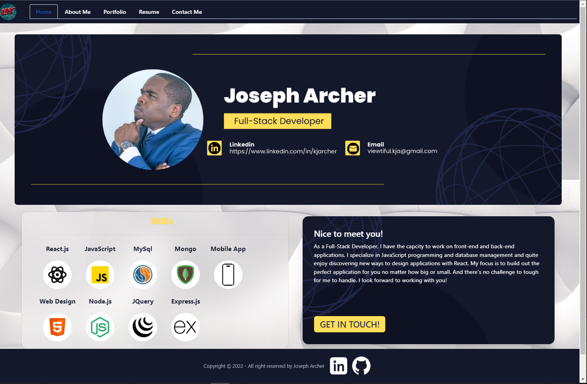

# React Portfolio

## **Description**

A React built portfolio that showcases my work to interested parties

## **Table of Contents**

1. [Installation](#Installation)
2. [License](#License)
3. [Questions](#Questions)

### **Installation**

1. Clone repositiory
2. Run npm start in terminal

### **License**

MIT

### **Questions**

**Project URL**

<https://archer261.github.io/react-portfolio/>

**Github Information**

Username: Archer261

Profile: <https://github.com/Archer261>

If you have any additional questions, I can be reached via email at <viewtiful.kja@gmail.com>
